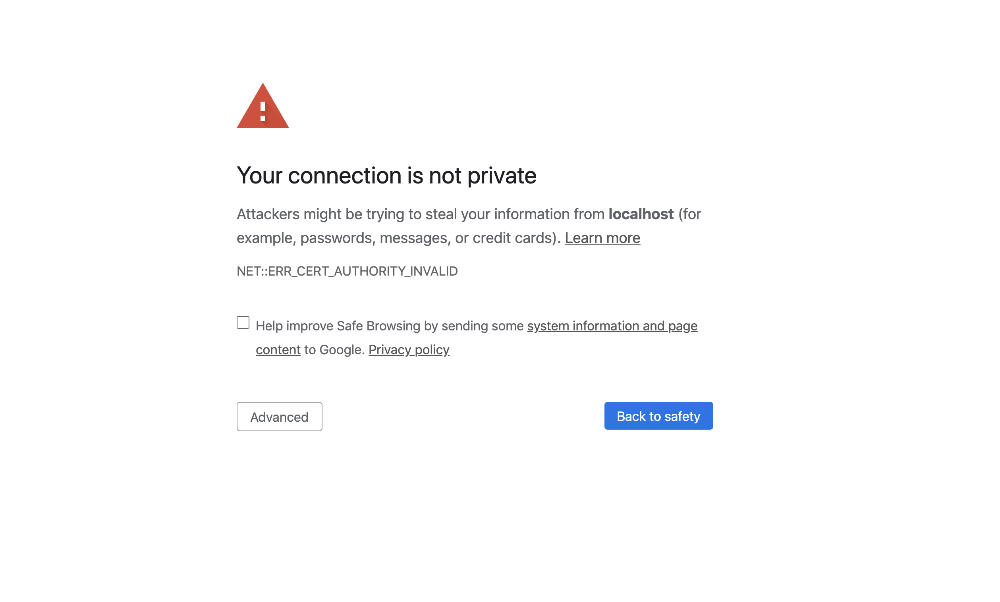
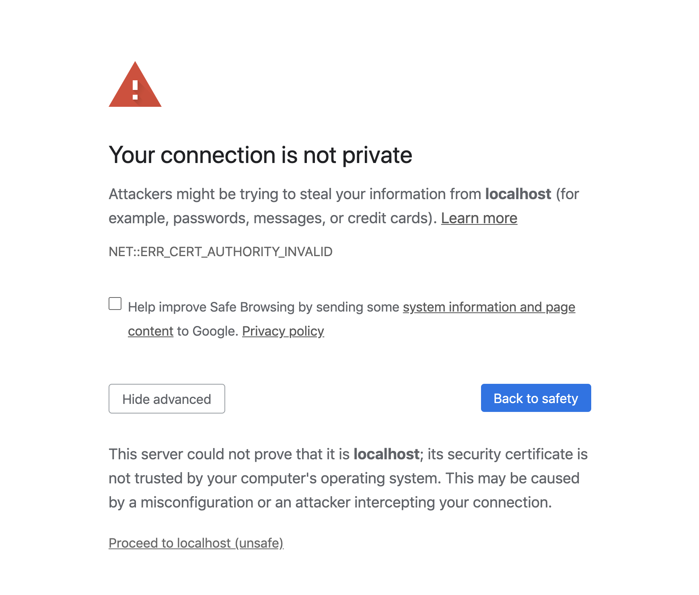

# Item Catalog User Manual
## Project Description
This is a web application that provides a catalog of movies by genres and integrate Facebook user registration and authentication. After Facebook login users should have the ability to post, edit, and delete their own genres or movies.

The application also implements a JSON endpoint that serves the same information as displayed in the HTML endpoints for an arbitrary genre or movie in the catalog.

## Prerequisite
Installing Git, Virtual Box, and Vagrant

### Install `Git`

If you don't already have Git installed, download Git from git-scm.com. Install the version for your operating system.

On Windows, Git will provide you with a Unix-style terminal and shell (Git Bash). (On Mac or Linux systems you can use the regular terminal program.)

You will need Git to install the configuration for the VM.

### Install `VirtualBox`

VirtualBox is the software that actually runs the VM. You can download it from [virtual box](virtualbox.org). Install the platform package for your operating system. You do not need the extension pack or the SDK. You do not need to launch VirtualBox after installing it.

Note: Currently (October 2017), the version of VirtualBox you should install is 5.1. Newer versions are not yet compatible with Vagrant.

Ubuntu 14.04 Note: If you are running Ubuntu 14.04, install VirtualBox using the Ubuntu Software Center, not the virtualbox.org web site. Due to a reported bug, installing VirtualBox from the site may uninstall other software you need.

### Install `Vagrant`

Vagrant is the software that configures the VM and lets you share files between your host computer and the VM's filesystem. You can download it from [vagrantup](vagrantup.com). Install the version for your operating system.

## Clone application code from Github
Windows: Use the Git Bash program (installed with Git) to get a Unix-style terminal.

Other systems: Use your favorite terminal program.

Log into your personal Github account, and then navigate to the [fullstack-nanodegree-vm](https://github.com/joyceyu6/fullstack-nanodegree-vm.git). You may fork the fullstack-nanodegree-vm so that you have a personal repo to test the application.

From the terminal, run:

```shell
git clone http://github.com/<username>/fullstack-nanodegree-vm fullstack
```

This will give you a directory named fullstack that is a clone of my remote fullstack-nanodegree-vm repository. Be sure to replace your username if you have formed my solution.

## Run the virtual machine(VM)
Using the terminal, change directory to `fullstack/vagrant`

```shell
cd fullstack/vagrant
```

Then type `vagrant up ` to launch your virtual machine. 

```shell
vagrant up
```

Once it is up and running, type `vagrant ssh` to log into it. This will log your terminal in to the virtual machine, and you'll get a Linux shell prompt. 

```shell
vagrant ssh
```

Once you log your terminal to the virtual machine, install ssl libary for python with following command, note that you only have to install this once, i.e., even if you log out of virtual machine, you don't have to install this again next time you log into your virtual machine:

```shell
sudo pip install pyOpenSSL
```

When you want to log out virtual machine, type `exit` at the shell prompt.  To turn the virtual machine off (without deleting anything), type `vagrant halt`. If you do this, you'll need to run `vagrant up` again before you can log into it. Be sure to change to the `/vagrant` directory by typing `cd /vagrant` in order to share files between your home machine and the VM. 

```shell
vagrant halt
```

## Run application within the VM

   
- Set up database structure
```shell
python database_setup.py
```

- Add initial data to database
```shell
python lotsofmovies.py
```

- Start server
```shell
python application.py
```

## Run and test application in web access
Visiting <https://localhost:8000> locally on your browser.

`IMPORTANT`: 
- Make sure to use secured connection to the server (i.e., use https:// instead of http://)
- You may get warning the first time when you run the app, please ignore the warning and proceed with the connection. For example, here is the warning message from Google Chrome web browser:
  
After you click `Advanced`, it will show more infomration, click on `Proceed to localhost(unsafe)` at the bottom of the message to proceed with testing
  
  
### Addtional notes when you test the application:
- Facebook login is required before any update (create,delete,edit) functions can be performed
- Users can only update the genre or movie created by themselves
- `JSON endpoint` testing: type below code on your broswer to get the same arbitrary information as displayed in the `HTML endppoints`:
  - Get all movie genres:
    <https://localhost:8000/genre/JSON>
  
  - Get all movies listed under selected genre:
    https://localhost:8000/genre/<int:genre_id>/movie/JSON
  
  - Get details of a movie:
    https://localhost:8000/genre/<int:genre_id>/movie/<int:movie_id>/JSON   